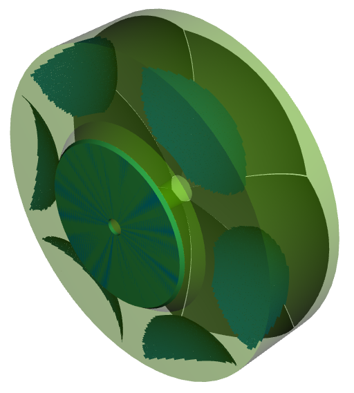
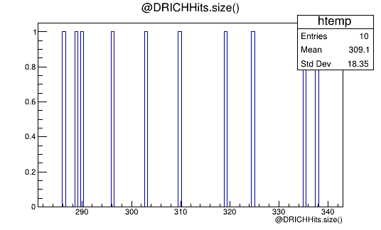
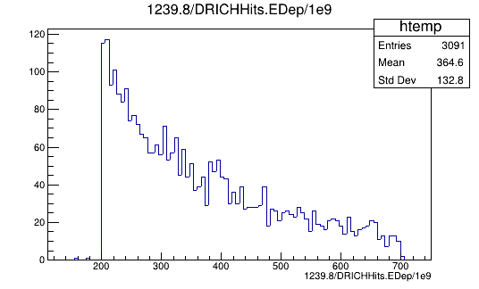
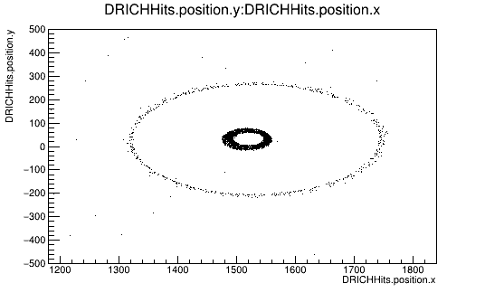
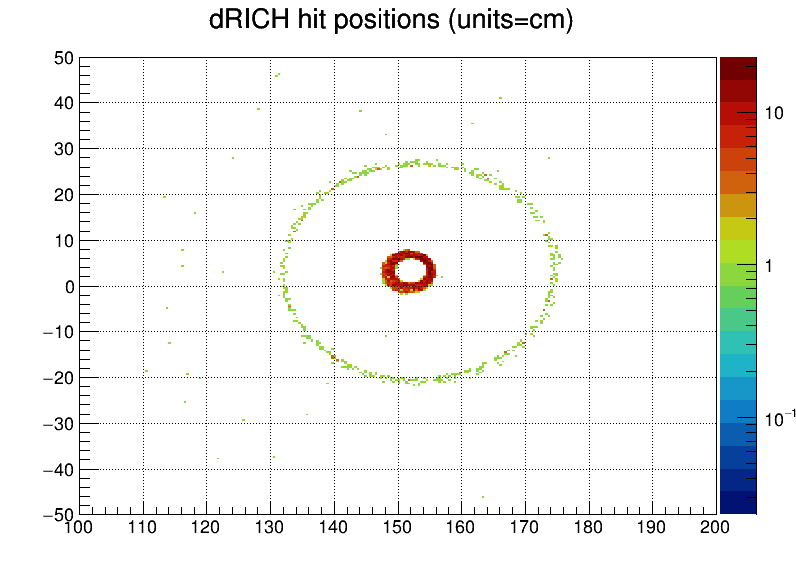

Tutorial 1: Setup and Running Simulations
=========================================

- [TUTORIAL RECORDING](https://duke.zoom.us/rec/play/Yw-MIwAVHgFw4XthFR1UMrXr5Byal0OaPAC1Q3TFoicZNJz3SUDnzCSfHp8BFv4Er-KoBVXTnUXV6GCK.eCqPDXFZFlyfCmZF?canPlayFromShare=true&from=my_recording&continueMode=true&componentName=rec-play&originRequestUrl=https%3A%2F%2Fduke.zoom.us%2Frec%2Fshare%2Fp8LyFsMFfAI1iKG5uaO_HITYEH1-mVHMGEkECwdl9_eRrReVg_FcsM_ksIbkI0o.SdMdb6ha55uUOTYJ)
- [Return to Tutorial Landing Page](README.md)

This is the first tutorial of the [dRICH Tutorial Series](README.md), which will cover setup and running of dRICH simulations.

## Prerequisite Common Training
1. Setup of eic-shell and Github: <https://indico.bnl.gov/event/16826/>
1. DD4hep geometry basics: <https://indico.bnl.gov/event/16828/>

## Clone Repositories
First, clone the necessary repositories from [Github](https://github.com) and from [EICweb](https://eicweb.phy.anl.gov/EIC). If you are a member of the [EIC organization on Github](https://github.com/eic) and a member of the [EPIC Devs Team](https://github.com/orgs/eic/teams/epic-devs), you may clone Github repositories with `SSH`, otherwise you must clone with `HTTPS`. Direct contributions to Github repositories requires `SSH` access, otherwise you must fork repositories. The story is the same for [EICweb](https://eicweb.phy.anl.gov/EIC): use `SSH` if you are a member, otherwise use `HTTPS`.

In today's tutorial we will only be working with the following repositories:
- `drich-dev`
- `epic`
- `EICrecon` (some `drich-dev` local code is dependent on this)

These are the only ones you need to clone for today. Future tutorials will use other repositories, so after today's tutorial, it is recommended to clone those as well. Here are the clone commands:

- `drich-dev`
  - `SSH`:
    ```bash
    git clone git@github.com:eic/drich-dev.git
    ```
  - `HTTPS`:
    ```bash
    git clone https://github.com/eic/drich-dev.git
    ```

Once you have a clone of `drich-dev`, you must `cd` into it, prior to cloning the other repositories:
```bash
cd drich-dev
```
Now proceed by cloning the other repositories (today we will only need `epic`):

- Github Repositories:
  - `SSH`:
    ```bash
    git clone git@github.com:eic/epic.git
    git clone git@github.com:eic/irt.git
    git clone git@github.com:eic/EDM4eic.git
    git clone git@github.com:eic/EICrecon.git
    ```
  - `HTTPS`:
    ```bash
    git clone https://github.com/eic/epic.git
    git clone https://github.com/eic/irt.git
    git clone https://github.com/eic/EDM4eic.git
    git clone https://github.com/eic/EICrecon.git
    ```
- EICweb Repositories:
  - `SSH`:
    ```bash
    git clone git@eicweb.phy.anl.gov:EIC/benchmarks/reconstruction_benchmarks.git
    ```
  - `HTTPS`:
    ```bash
    git clone https://eicweb.phy.anl.gov/EIC/benchmarks/reconstruction_benchmarks.git
    ```

During development, you may make changes to multiple different repositories, and may be on different branches on each. To help keep track, there are two scripts:
```bash
./check_branches.sh   # list the current branch on every repository
./check_status.sh     # run 'git status' for each repository
```

## Building Repositories
The `eic-shell` image contains all of the necessary software to run ePIC simulations and reconstruction, including builds of the repositories that you cloned above. We make our own clones here in `drich-dev`, so that you may override the `eic-shell` image builds and make changes.

From here on, you must be in an `eic-shell` container shell.

You can find which versions of software are installed in `eic-shell` by running:
```bash
eic-info
```
You may also find the installations themselves at `/usr/local`, which is useful if you want to check header files or libraries.

Let's now build the local repositories, which will override the `eic-shell` builds.

First, set the environment variables:
```bash
source environ.sh
```

Check if the number of CPUs was detected correctly:
```bash
echo $BUILD_NPROC
```
If it is wrong, then we need to fix the number detection in `environ.sh`; for now just hard code the correct number in `environ.sh` and run `source environ.sh` again, or just run
```bash
export BUILD_NPROC=<CORRECT_NUMBER>
```
replacing `<CORRECT_NUMBER>` with the correct number

Practically all repositories use `cmake`, so you may proceed using the typical `cmake` commands. For convenience, `drich-dev` provides a `cmake` wrapper `build.sh` to build any local repository. The syntax is:
```bash
build.sh <REPOSITORY>        # build a repository named <REPOSITORY>
build.sh <REPOSITORY> clean  # remove the cmake buildsystem, and then build
```
By default, the installation prefix (`CMAKE_INSTALL_PREFIX`) will be `$EIC_SHELL_PREFIX`. Running `source environ.sh` has modified your default `$EIC_SHELL_PREFIX` to a local directory: `./prefix`; this directory is where all the software that `build.sh` builds will be installed.

Today, we only need to build `epic` (you do not need to build `EICrecon` yet):
```bash
build.sh epic
```
It's not yet necessary, but you may build the other repositories by running:
```bash
build.sh irt
build.sh EDM4eic
build.sh EICrecon
build.sh reconstruction_benchmarks
```
Important: if you choose to build all of the repositories, you need to be sure to build them in the correct order of dependence. You can build all of the repositories in this order by running:
```bash
rebuild_all.sh        # build all the repositories (that you have cloned) in the recommended order
rebuild_all.sh clean  # remove the cmake buildsystems, and then build
```

Notice that the build scripts allow for a `clean` option, which is useful for starting over from a clean state. In case you want to clean everything and start over, simply remove the `./prefix` directory, then run `rebuild_all.sh clean`. This is also useful to do after upgrading your `eic-shell` image (run `eic-shell --upgrade`), which you should do regularly, unless you are using a CVMFS build.

After you have built the repositories, sourcing the environment variables file will set some additional variables to complete the override of `eic-shell`; run it again:
```bash
source environ.sh
```
Now that you have a build installed in `./prefix`, the next time you open an `eic-shell` container, you just need to run `source environ.sh` to get started.

Finally, build the local code in `drich-dev`, which uses a `Makefile`:
```bash
make        # build drich-dev code
make clean  # remove drich-dev build (run 'make' again afterward to rebuild)
```

## Exploring the Geometry
The `epic` repository contains the geometry for ePIC and is based on [DD4hep](https://github.com/AIDASoft/DD4hep). The [next tutorial](2-geometry-code.md) will go over the code within, but today we will learn how to run it.

### Viewing the Geometry
First, let's look at the dRICH geometry itself. The `geoConverter` command is used for this; for convenience `drich-dev` provides a wrapper: `geometry.sh`. Run:
```
geometry.sh      # print the usage guide
geometry.sh -d   # make a TGeo ROOT file for the dRICH only
geometry.sh -e   # make a TGeo ROOT file for the full ePIC detector
```
By default the output file will be `geo/detector_geometry.root`. You may open it with ROOT or [JSROOT](https://root.cern/js/). For JSROOT, you may use a hosted instance (found in the aforementioned link), or you may host your own instance (see below; this is convenient if you intend to make many geometry changes).

Coordinate system:
- x axis is horizontal, to the left when facing the dRICH
- y axis is vertical, toward the sky
- z axis is along the electron beamline, toward the dRICH



### Geometry Constants
There are several constant numbers in the geometry, for example, the z-position of the dRICH. You may view them using the `npdet_info` tool; for convenience, `drich-dev` provides a wrapper script `search_compact_params.sh`. Run:
```bash
search_compact_params.sh                   # print the usage guide
search_compact_params.sh -e                # dump all of the constants for ePIC
search_compact_params.sh -e | grep DRICH   # dump all of the constants for the dRICH (they all begin with 'DRICH')
```
The first column is the constant name, the second is the raw value (numbers in standard DD4hep units), and the third column is the original formula or specification used for the constant). Length units are centimeters.

### Aside: Checking for overlaps
Checking for geometry overlaps is a computationally intensive procedure; therefore, it is better to let the Continuous Integration (CI) run overlap checks. CI jobs are triggered by every commit to a branch associated with a pull request. If you want to run overlap checks locally, run `overlap_check.sh`.

### Aside: Hosting JSROOT Yourself
Using a remotely hosted JSROOT instance has its limitations; namely, every time you make a change to the geometry you must re-upload the TGeo ROOT file. For better productivity, consider self-hosting by following this guide.

First, download a [release of JSROOT](https://github.com/root-project/jsroot/releases) and unpack it to somewhere, for example `~/jsroot`.

Make a symbolic link to the `drich-dev/geo` subdirectory
```bash
ln -s /path/to/drich-dev/geo ~/jsroot/
```

Add the following script, named `jsroot` to your `$PATH`:
```bash
#!/bin/bash
pushd ${HOME}/jsroot  # change this to wherever you unpacked the jsroot release
echo "FOR FULL DETECTOR:"
printf "\nhttp://localhost:8000/?file=geo/detector_geometry.root&dark&opt=ctrl;\n\n"
echo "FOR DRICH ONLY:"
printf "\nhttp://localhost:8000/?file=geo/detector_geometry.root&dark&item=default/world_volume/DRICH_0/DRICH_gas_0&opt=ctrl;vislvl8;more\n\n"
echo "FOR PFRICH ONLY:"
printf "\nhttp://localhost:8000/?file=geo/detector_geometry.root&dark&item=default/world_volume/PFRICH_0/PFRICH_gas_0&opt=ctrl;vislvl8;more\n\n"
echo "============================================"
python -m http.server
popd
```

Run `jsroot` from your shell (not `eic-shell`) and open one of the URLs in your browser (when you are done, you may terminate the HTTP server by pressing `^C`). As you make changes to the geometry in `epic`, you just need to:
```
build.sh epic && geometry.sh -d   # or your preferred option, such as -e
```
Then refresh the webpage you have opened in your browser to see the update.

## Running Simulations
Now let's throw particles at the dRICH. To run simulations in DD4hep, use `ddsim`; however, this will not enable Cherenkov physics. ePIC therefore uses [an extended version of `ddsim`, called `npsim`](https://github.com/eic/npsim), to enable Cherenkov physics and some [other settings for the PID detectors](https://github.com/eic/npsim/blob/main/src/dd4pod/python/npsim.py).

Here in `drich-dev`, we have a wrapper of `npsim` specific for the dRICH: `simulate.py`. This script generates Geant4 macro files and runs them with `npsim`. You can either run one of the "tests" or supply a `hepmc` file. Run with no arguments for a usage guide:
```bash
simulate.py
```

Let's run test 1 with 10 events, which will throw 10 pi+s at the angle of theta=23.5 degrees, 20 GeV each (the defaults, at the time of writing this tutorial):
```bash
simulate.py -t1 -n10
```
_Exercise_: try other particles, energies, angles, or other tests.

### View The Results in ROOT

The resulting file will be `out/sim.edm4hep.root` and it contains the `TTree` called `events`. Let's open the file:
```bash
root out/sim.edm4hep.root
new TBrowser()
```
For convenience, `environ.sh` added a function `broot()` to automatically open a file in a `TBrowser`, so you could alternatively run `broot out/sim.edm4hep.root`.

The dRICH simulated hits (pre-digitization) are in the `DRICHHits` branch. The datatype is `edm4hep::SimTrackerHit`, and as part of the common [Event Data Model for High Energy Physics (EDM4hep)](https://github.com/key4hep/EDM4hep), you may find [documentation here](https://github.com/key4hep/EDM4hep/blob/c19868254a63d684152056cb1ee371c23a011a41/edm4hep.yaml#L208-L239)

Draw the number of incident photons per event:
```bash
events->Draw("@DRICHHits.size()")   // the syntax for this particular TLeaf is a bit strange, but see the TBrowser view
```



Draw the energy deposition:
```bash
events->Draw("DRICHHits.EDep")
```
The units are standard: GeV. Let's instead draw the wavelength in nanometers:
```bash
events->Draw("1239.8/DRICHHits.EDep/1e9")
```



(note there are cutoffs at 200 and 700 nm, because of issues in the material property tables).


Draw the (true, non pixelated) hit positions:
```bash
events->Draw("DRICHHits.position.y:DRICHHits.position.x")
```
Zoom in on the Cherenkov rings



Alternatively, `drich-dev` provides the executable `draw_hits` to draw these hits:
```bash
draw_hits d
display out/sim.edm4hep.hits.png
```




_Exercise_: Check out the other branches and make some plots.

_Exercise_: Run some of the other tests, for example, scanning over theta (test 4), theta and azimuth (test 5), or momentum (tests 7 and 8). Note that optics tests are special tests that will be described below.

### Event Display

`drich-dev` provides an event display program. Run `event_display` for a usage guide.

Draw all of the events in one:
```bash
event_display d s out/sim.edm4hep.root
```
View the image in `out/ev/`.


You may also draw one event at a time (see the usage guide)
```bash
event_display d s out/sim.edm4hep.root n 0 0
```
View the images in `out/ev/`.

Each green box is a single SiPM, and each histogram bin is a single SiPM pixel (8x8 pixels per SiPM). If you want to zoom in, use interactive mode by changing `n` to `i`, which will keep the `TCanvas` open and allow you to zoom in. For example, here is a closeup of the gas ring from a single event, by running
```bash
event_display d s out/sim.edm4hep.root i 0
```


